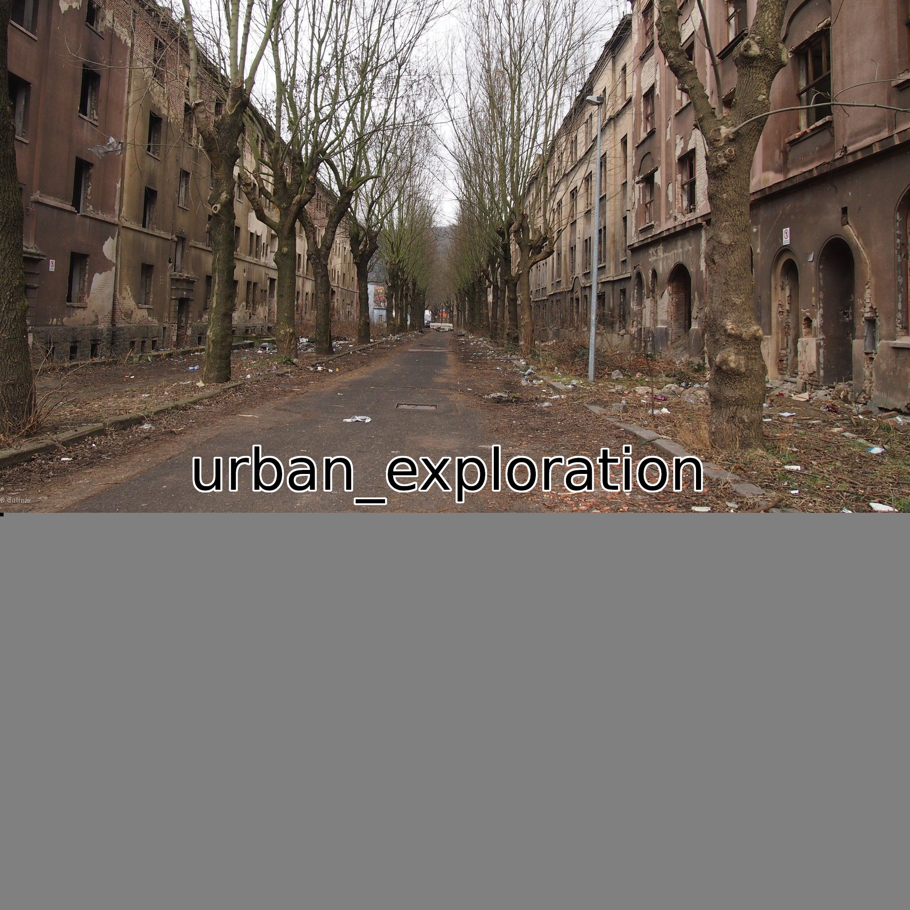

# abandoned place
[Link to the challenge](https://ctflearn.com/challenge/1000)

Dimensions, dimensions, dimensions... This challenge is pretty tricky. I had to read writeups or I would have not been able to finish it. It shouldn't belong in the easy category (in my opinion).

## Step 1
We are given an image. I downloaded it, view it, and run my go-to commands (`file`, `strings`/`hexdump -C`, `exiftool`, `binwalk`, `foremost`, and `steghide`).
<p align="center">
    
</p>

But no interesting output.

## Step 2
After thinking twice, I remembered we were told about dimensions.

I tried to run `imagemagick` but the image stayed the same.

## Step 3
With the help of another writeup, I found the solution.

Firstly, I googled `where the height and width are stored in jpeg` and found this stackoverflow: https://stackoverflow.com/questions/13111228/getting-width-and-height-from-jpeg-image-file

From the StackOverflow, I learned that JPEGs are split into sections/frame, and each section starts with `0xFF`. The next two bytes are the identifier, the first one being `0xC0`. 

Then, I looked for the [JPEG syntax and structure]("https://en.wikipedia.org/wiki/JPEG#Syntax_and_structure").

| Bytes      | Name/Function                 |
|------------|-------------------------------|
| 0xFF, 0xD8 | Start Of Image                |
| 0xFF, 0xC0 | Start Of Frame (baseline DCT) |

And it confirmed what I've learned just before.

## Step 4
I used `xxd abondoned_street_challenge2.jpg | grep -i "FFC?"` and incremented the `?` to see how many sections/frame the jpeg files  contain.

Luckily it only contains one frame!
```bash
$ xxd abondoned_street_challenge2.jpg | grep -i "FFC0"
00000090: 1414 1414 1414 1414 1414 1414 1414 ffc0  ................

...
```
The first and only frame starts at `00000090`.

Now I had to find the current height and width. `exiftool` allowed me to find this quickly!

```bash
...
Y Resolution                    : 314
Image Width                     : 2016
Image Height                    : 900
Encoding Process                : Baseline DCT, Huffman coding
...
```

So it's 2016x900!

I converted this in hexadecimal:
`Width = 2016 = 0x07 0xE0`
`Height = 900 = 0x03 0x84`

It was time to search those values in the frame.

## Step 5
Using `hexedit`, I was able to move more freely and modify value:
```
...

00000090   14 14 14 14  14 14 14 14  14 14 14 14  14 14 FF C0  ................
000000A0   00 11 08 03  84 07 E0 03  01 11 00 02  11 01 03 11  ................

...
```
Line `000000A0` I saw `03  84 07 E0` which is the height and width.

I decided to modify the height to `07 E0`. So it would give me a square image.

After saving the changes, I had this result:
<p align="center">
    
</p>

I had the flag!

## Solution
The flag is `CTFlearn{urban_exploration}`